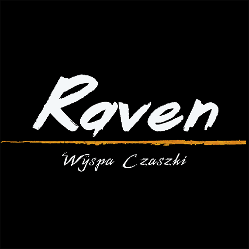

<h1>Raven: Skull Island</h1>

Raven: Skull Island is a third-person action-adventure game with puzzle-solving elements, set on a mysterious and cursed island.

You play as Raven, a young pirate who miraculously survives a shipwreck caused by a violent storm. But something is wrong. She’s alive, yet not quite herself. A dark curse has bound her to the island, where the souls of long-dead pirates still linger in the form of haunted skulls.

Face the mystery, survive the curse, and fight to escape Skull Island before it consumes you completely.

The game was originally developed by a 6-person team as part of a graduation project at Game Dev School:
* Programming: Patryk Niewiarowski
* Lead Artist: Daniel Pytel
* Additional Art: Marcin Świgut
* Game Design: Andrzej Kula, Wojciech Nikorowicz, Łukasz Lampka
* Project Mentor: Andrzej Zawadzki, former Lead Gameplay Designer at CD PROJEKT RED

The initial commit reflects the exact [state](https://www.youtube.com/watch?v=zeqDeDUHbcQ) of the project at the time it was submitted for evaluation at Game Dev School.

All subsequent updates, including bug fixes, graphical improvements, and design changes, are the result of solo development work by me, Daniel Pytel.

The purpose of this archive is to maintain, improve, and expand the game while keeping it functional with the latest engine version.

Main goals of this repository:
* Preserving and updating the original version of the project
* Fixing existing bugs and refining gameplay mechanics
* Improving visuals and performance on modern hardware and Unity versions
* Reworking or restoring cut features like melee combat and boss encounters
* Expanding content with new areas, puzzles, and narrative elements
* Keeping the spirit of the original project alive while pushing its potential further
